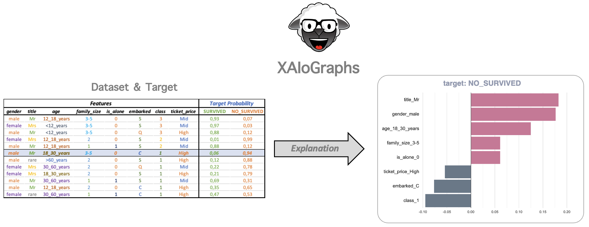

#   XAIoGraphs


[](https://www.gnu.org/licenses/agpl-3.0)

XAIoGraphs (e**X**plainability **A**rticicial **I**ntelligence **o**ver **Graphs**) is an Explicability and Fairness 
Python library for classification problems with tabulated and discretized data.

The explainability methods in this library don't make any form of hypothesis about the data, so it does not require the AI model.
Simply need data and predictions (or decisions), being able to explain AI models, rule models, and reality.

<p align="center">
    
</p>

This library includes the following functionalities:

+ **Global Explainability**: Explains predictions or decisions as a whole, focusing on the variables that have the most influence.
+ **Local Explainability**: Explains the prediction of a single element.
+ **Reliability Measure** of local explainability.
+ **Resaon Why:** *explanation in natural language* of the classification of each element.
+ **Fairness Scoring**: highlights potential discriminations in classifications based on sensitive features.

To understand or ***interpret the explanations*** uses ***XAIoWeb***, a ***web interface*** running in local mode (127.0.0.1:8080). 
It displays the explanations' outcomes in three sections: Global, Local and Fairness.

<p align="center">
    
</p>


# 🚀 Quickstart 

## 🔨 Installation XAIoGraphs

Create a virtual environment using conda for easier management of dependencies and packages. 
For installing conda, follow the instructions on the [official conda website](https://docs.conda.io/projects/conda/en/latest/user-guide/install/)

```python
>> conda create --name xaio_env python=3.7
>> conda activate xaio_env
```

```{warning} 
Use a python version 3.7 or higher
```


**From PyPI repository** - NO DISPONIBLE HASTA PUBLICACIÓN DE LA LIBRERÍA
```python
>> pip install xaiographs
```

**Desde el Artifactory hasta publicación** - ELIMINAR ESTA PARTE AL PUBLICAR LA LIBRERÍA
```python
>> pip install http://artifactory.hi.inet:80/artifactory/iuc-4pl/com/telefonica/xaiographs/XAIoGraphs-0.0.1-py3-none-any.whl
```

## 📝 Start with your first example

Use the following entry point to view an example run with the virtual environment enabled:

```python
>> titanic_example
```

Alternatively, you may run the code below to view a full implementation of all XAIoGraphs functionalities:

```python
from xaiographs import Explainer
from xaiographs import Why
from xaiographs import Fairness
from xaiographs.datasets import load_titanic_discretized, load_titanic_why

LANG = 'en'

# LOAD DATASETS & SEMANTICS
df_titanic, feature_cols, target_cols, y_true, y_predict = load_titanic_discretized()
df_global_semantics, df_target_semantics, df_why_templates = load_titanic_why(language=LANG)

# EXPLAINER
explainer = Explainer(dataset=df_titanic, importance_engine='LIDE', verbose=1)
explainer.fit(feature_cols=feature_cols, target_cols=target_cols)

# WHY
why = Why(language=LANG,
          local_reliability=explainer.local_dataset_reliability,
          local_feat_val_expl=explainer.local_feature_value_explainability,
          why_elements=df_global_semantics,
          why_templates=df_why_templates,
          why_target=df_target_semantics,
          sample_ids_to_export=explainer.sample_ids_to_display,
          verbose=1)
why.fit()

# FAIRNESS
f = Fairness(verbose=1)
f.fit(df=df_titanic[feature_cols + [y_true] + [y_predict]],
      sensitive_cols=['gender', 'class', 'age'],
      target_col=y_true,
      predict_col=y_predict)
```

Following execution, a folder called "xaioweb files" is created, which contains a set of '.json' files that will 
be used to present the results in the XAIoWeb graphical interface.

## 📊 Launching XAIoWeb

XAIoWeb is a local web interface that displays the outcomes of the explanations in three sections: Global, Local, 
and Fairness. To launch the web (with the virtual environment enabled), run the following entry point:

```python
>> xaioweb -d xaioweb_files -o
```

This entry point takes the following parameters:

- `-d` o `--data` [REQUIRED]: JSON files path
- `-p` o `--port` [OPTIONAL]: Web server port. 8080 by default
- `-o` o `--open` [OPTIONAL]: Open web in browser


# 🤝 Contributors

XAIoGraphs has been developed by the AI Products team (Telefónica I+D - Chief Data Officer)

* [Ricardo Moya](https://github.com/TFRicardoMoya)
* [Matteo Salvatori](https://github.com/matteo-salvatori)
* [Enrique Fernandez](https://github.com/QuiqueFdez)
* [Alejandro Manuel Arranz](https://github.com/cx02747)
* [Manuel Martín](https://github.com/mmarmar)
* [Mario Villaizan](https://github.com/mvvmvv)
* [Cesar García](https://github.com/cesarggtid)
* [David Cadenas](https://github.com/davidcadi)
* Alejandra Maria Alonso
* [Miguel Angel Martín](https://github.com/mamj-telefonica)
* [Oriol Arnau](https://github.com/oarnau)


# 📥  Contact

Contact with [@Ricardo Moya](https://github.com/TFRicardoMoya)
