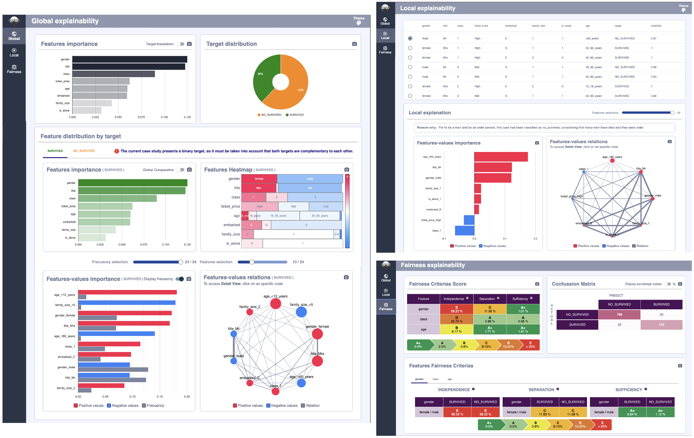

#   XAIoGraphs


XAIoGraphs (e**X**plainability **A**rticicial **I**ntelligence **o**ver **Graphs**) is an Explicability and Fairness 
Python library for classification problems with tabulated and discretized data.


<p align="center">
    
</p>

This library offers the following functionalities:

+ **Global Explainability**: explains the results of the model as a whole, selecting the variables that have the greatest impact on the model.
+ **Local Explainability**: explains the prediction of a single element.
+ **Reliability Measure** of local explainability.
+ **Resaon Why:** *explanation in natural language* of the classification of each element.
+ **Fairness Scoring**: identifies possible discriminations in the classifications made on certain sensitive variables.

To ***interpret the explanations*** we have ***XAIoWeb***, which is a ***web interface*** executed in local mode (localhost:8080), 
which shows the results of the explanations in 3 sections: Global, Local and Fairness:

<p align="center">
    
</p>


# 🚀 Quickstart 

## 🔨 Installation XAIoGraphs

Create a virtual environment using conda for easier management of dependencies and packages. 
For installing conda, follow the instructions on the [official conda website](https://docs.conda.io/projects/conda/en/latest/user-guide/install/)

```python
conda create --name xaio_env python=3.7
conda activate xaio_env
```

⚠️ We recommend using Python 3.7 or above.


**From PyPI repository** - NO DISPONIBLE HASTA PUBLICACIÓN DE LA LIBRERÍA
```python
pip install xaiographs
```

**Desde el Artifactory hasta publicación** - ELIMINAR ESTA PARTE AL PUBLICAR LA LIBRERÍA
```python
pip install http://artifactory.hi.inet:80/artifactory/iuc-4pl/com/telefonica/xaiographs/XAIoGraphs-0.0.1-py3-none-any.whl
```

## 📝 Start with your first example

With the virtual environment enabled, you can run the following entry point to see a sample run:

```python
titanic_example
```

Or if you prefer, you can execute the following code to see a complete execution of all the XAIoGraphs functionalities:

```python
from xaiographs import Explainer
from xaiographs import Why
from xaiographs import Fairness
from xaiographs.datasets import load_titanic_discretized, load_titanic_why

LANG = 'en'

# LOAD DATASETS & SEMANTICS
df_titanic, feature_cols, target_cols, y_true, y_predict = load_titanic_discretized()
df_global_semantics, df_target_semantics, df_why_templates = load_titanic_why(language=LANG)

# EXPLAINER
explainer = Explainer(dataset=df_titanic, importance_engine='TEF_SHAP', verbose=1)
explainer.fit(feature_cols=feature_cols, target_cols=target_cols)

# WHY
why = Why(language=LANG,
          local_reliability=explainer.local_dataset_reliability,
          local_feat_val_expl=explainer.local_feature_value_explainability,
          why_elements=df_global_semantics,
          why_templates=df_why_templates,
          why_target=df_target_semantics,
          sample_ids_to_export=explainer.sample_ids_to_display,
          verbose=1)
why.fit()

# FAIRNESS
f = Fairness(verbose=1)
f.fit(df=df_titanic[feature_cols + [y_true] + [y_predict]],
      sensitive_cols=['gender', 'class', 'age'],
      target_col=y_true,
      predict_col=y_predict)
```

After execution, a folder called "xaioweb_files" is created that contains a series of .json files to display the 
results in the XAIoWeb graphical interface.

## 📊 Launching XAIoWeb

XAIoWeb is a web interface executed in local mode, which shows the results of the explanations in 3 sections: Global, Local and Fairness. 
To run the web (with the virtual environment activated), you must execute the following entry point:

```python
xaioweb -d xaioweb_files -o
```

This entry point takes the following parameters:

- `-d` o `--data` [REQUIRED]: JSON files path
- `-p` o `--port` [OPTIONAL]: Web server port. 8080 by default
- `-o` o `--open` [OPTIONAL]: Open web in browser


# 🤝 Contributors

XAIoGraphs has been developed by the AI Products team (Telefónica I+D - Chief Data Officer)

* [Ricardo Moya](https://github.com/TFRicardoMoya)
* [Matteo Salvatori](https://github.com/matteo-salvatori)
* [Enrique Fernandez](https://github.com/QuiqueFdez)
* [Alejandro Manuel Arranz](https://github.com/cx02747)
* [Manuel Martín](https://github.com/mmarmar)
* [Mario Villaizan](https://github.com/mvvmvv)
* [Cesar García](https://github.com/cesarggtid)
* David Cadenas
* Alejandra Maria Alonso
* [Miguel Angel Martín](https://github.com/mamj-telefonica)
* [Oriol Arnau](https://github.com/oarnau)


# 📥  Contact

Contact with [@Ricardo Moya](https://github.com/TFRicardoMoya)
