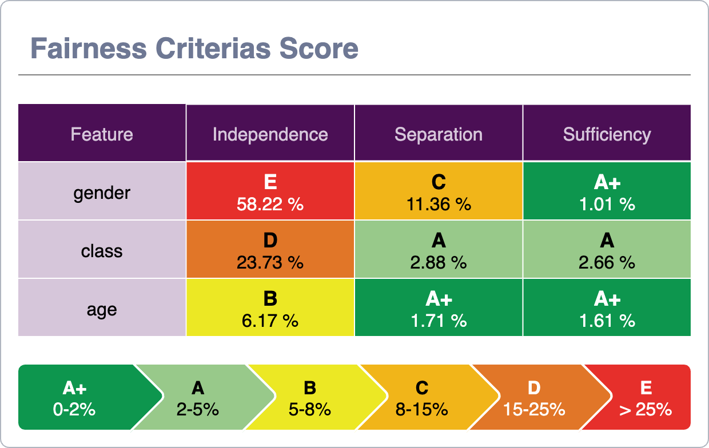

# 💻  XAIoWeb

In this section we will analyze the different modules and components of the web.

We will see the behavior and the explanation of each of the graphs that make up it.

Each of the graphs that we will see below has a functionality that allows its export as an image to facilitate being included in any report and presentation.
To do this, you will need to click on the camera icon located in the upper right corner.

---

&nbsp;
## Global Explainability

The Global module presents a statistical calculation on the main characteristics of the dataset.

It must be understood that all entries in the dataset are analyzed individually and their statistics are subsequently aggregated in this module.

It is important to understand that the results are presented at the level of the entire dataset and according to the different targets that make up it.

The page is divided into two major sections, the top (formed by the Features Importance and Target distribution graphs) displays the information of the entire dataset.
The bottom, under the title "Feature distribution by target", shows the features information for a specific target, displaing consolidated calculations grouped by the target value.

Next, we will look at each of the graphs that make up it and its meaning.

&nbsp;
### <strong>Features importance</strong>

This graph displays at a general level (regardless of the target) the importance ordered downward of each of the features of the dataset.
The importance of these is represented, not only by the length of the horizontal segment but also by its opacity level.

Take notes that in the upper right corner of the chart, next to the export function, we have a switch that allows you to show the breakdown of values according to the target.

As an important note, the colors of the targets that the graph located to the right (Target distribution) have beenined to facilitate their reading.
The X-axis has also been removed as the numerical values are different from the aggregate view (as the representative is the size of the horizontal sections) to avoid errors in the interpretation of the data.

&nbsp;
### <strong>Target distribution</strong>

This graph displays the distribution of targets across the dataset.

It is a simple statistical tool to contextualize the information contained in the dataset and visually see the importance of each of the targets.

&nbsp;
### <strong>Feature importante (by target)</strong>

In this case, the graph is similar to the one located right above, but only those records have been taken into account for the selected target.

Take notes that in the upper right corner of the chart, next to the export function, we have a switch that allows you to compare the values of the selected target with the general data shown in the top chart. In the specific case of datasets with binary target (there are only 2 possible values for the target) this graph will show overlapping graphs, as the average values of a target are annulled with those of the opposite.

&nbsp;
### <strong>Feature Heatmap (by target)</strong>

This graph displays a heat map with the different values that the features of the dataset can take.
Those values that are most on the left will be those that contribute most positively to the target (represented by the redest color) and those located more on the right will contribute more negatively.

The different numerical values are represented depending on the opacity of the color, so that those more relevant (both positively and negatively) will have a more solid color, while those closer to the value 0 will be a more white color.
The length of each of the possible values of a feature represents the number of occurrences of that value within the dataset, so that the longer values have more presence while the smaller ones have little occurrence in the data.

&nbsp;
### <strong>Features-values importance (by target)</strong>

This graph displays the specific contribution values for the feature/value pairs. This can be positive (represented in red) or negative.(representado en azul)

It is important to note that the values shown are the same as those shown on the HeatMap.

Take notes that in the upper right corner of the chart, next to the export function, we have a switch that allows you to visualize the frequency of the feature/value (Represented in the HeatMap by its length)

&nbsp;
### <strong>Features-values relations (by target)</strong>

This graph displays the relationships between the different features/values.

&nbsp;

<em>It is important to emphasize that these two last graphs are filtered thanks to sliders located just above them.</em>

<em>By shifting each of the bars, viewing criteria can be modified to analyze different data behaviors.</em>

---

&nbsp;

## Local Explainability

The Local module presents the individual results, showing and explaining the results for a given dataset record.

Like the case of the previous module, the page is distributed into two important sections, the top presents a table with the dataset records, having by columns the different features. And the bottom that shows the calculations made for the selected record of the dataset. 

&nbsp;
### <strong>Dataset</strong>

This section displays the dataset records on which the calculations have been made, each of the features is presented in columns with the specific values taken.

It is important to note two very representative columns, the first is a checkbox that allows you to select the record on which the data is analyzed and which will be taken as a reference for the graphics located at the bottom of the screen.

And the last column called 'reliability', this represents a measure of the quality of the data. Since the XaioGraph does not have access to the model, it must predict the target of each record based on the analysis of the dataset, that is why there may be discrepancies between reality and prediction, and this column is what it represents, the degree of equality between the real target and the predict, which is why the records with values close to 1 are those in which both coincide and therefore the error dragged when generating individual calculations is much smaller.

&nbsp;
### <strong>Local Explantion (Reason Why)</strong>

This section shows a brief verbal explanation of the data that make up the record of the selected dataset. Underlining the reasons why this case has the target it has.

&nbsp;
### <strong>Features-values importance</strong>

This graph displays the specific contribution values for the feature/value pairs. This can be positive (represented in red) or negative.(representado en azul)

&nbsp;
### <strong>Features-values relations (by target)</strong>

This graph displays the relationships between the different features/values.

&nbsp;

<em>It is important to emphasize that these two last graphs are filtered thanks to the slider located just above them.</em>

<em>By shifting the bar, the most relevant features can be displayed, so as to facilitate their reading and understanding.</em>

---

&nbsp;

## Fairness

The fairness module shows the results from an ethical point of view, trying to detect possible misconduct or conditioners that can generate sensitive variables such as gender, age, etc. that can give the case of discrimination or harm.

Following the same structure as the previous modules, the page is divided into two. In the upper part we can see an analysis of all those variables detected that can constitute a case of bias and that its analysis is recommended in detail.
While at the bottom, we enter the specific details of each of these variables mentioned in the top section.

To facilitate the understanding and reading of the data, a similar color scheme has been chosen for employees in other fields such as the Nutriscore Index in food or energy efficiency in appliances or construction. It is therefore a color scale from green to red.
Therefore, green values are those with values closer to 0 and therefore do not present any relevant anomalies. While red are those that have exceeded a threshold of tolerance and it is important to analyze it in detail.

&nbsp;
### <strong>Fairness Criterias Score</strong>

This graph shows the analysis performed for each of the sensitive features based on the criteria of Independence, Separation and Sufficiency.

&nbsp;
### <strong>Confussion Matrix</strong>

This graph is a confusion matrix to represent the performance of the prediction algorithm.

As in any confusion matrix, columns represent the number of predictions for each target while rows represent the real class instances.

Take notes that in the upper right corner of the chart, next to the export function, we have a switch that allows you to analize the numeric values or percentage values.

&nbsp;
### <strong>Features correlation (by feature)</strong>

This section displays the different degrees of correlation of the selected feature with the remaining features of the dataset, showing the Pearson correlation value

&nbsp;
### <strong>Independence, Separation & Sufficiency values (by feature)</strong>

These three graphs show the values of Independence, Separation and Sufficiency of the selected feature, making a breakdown and analysis of each of the possible values it has

